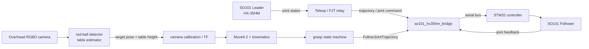

# SO101 HX35HM ROS 2 Workspace

[](https://github.com/Microluma/so101_hx35hm/actions/workflows/repository-checks.yml)

一个面向 `SO101 follower + HX-35HM + MoveIt 2 + RGBD 视觉` 的 ROS 2 Jazzy 真机工作区。项目的核心不是单一 demo，而是把舵机总线、轨迹执行、视觉定位、MoveIt 规划和真机抓取整合成可调试的完整链路。

> 项目定位：本仓库是一个本科阶段的机器人系统工程项目，重点展示真机集成、问题定位和实验验证能力。它基于现有开源组件开发，上游与项目特定工作的边界见下文。

## 解决了什么问题

SO101 生态中的默认控制链不能直接覆盖当前 HX-35HM + STM32 硬件组合。本项目围绕下列问题展开：

- 如何将 ROS 2 关节命令和 `FollowJointTrajectory` 轨迹转换为 HX-35HM 真机控制。
- 如何在有限串口带宽下平衡主臂回读频率、从臂写入频率、平滑度和跟随误差。
- 如何将 RGBD 相机的红球检测结果通过内参、手眼外参和 TF 链转换到机械臂基座坐标系。
- 如何让 MoveIt 规划、桌面碰撞约束和 `hover -> pregrasp -> grasp -> retreat -> rest` 抓取状态机在真机上稳定协同。

## 当前能力

- HX-35HM 真机桥接、舵机映射、零位与方向校准
- MoveIt 2 规划、RViz 交互与轨迹执行
- 主臂到从臂的遥操与 FJT 执行链调优
- 顶视 RGB/RGBD 相机、红球检测与桌面高度估计
- 相机内参、手眼外参和 RGB-depth 对齐调试工具
- 红球定位、运动规划、抓取、回位和放球的完整流程
- rosbag2/MCAP 录制、LeRobot 数据转换与推理链路

## Demo

### 红球视觉识别与抓取

SO101 通过顶视相机识别红球，并执行定位、运动规划与抓取。

https://github.com/user-attachments/assets/63459b54-5808-4aff-9fd8-a557a9e66077

### 主从臂跟随控制

从臂实时跟随主臂动作，展示 HX-35HM 主从遥操控制效果。

https://github.com/user-attachments/assets/6b907dc1-2aa6-41a9-9c77-5fd130d048e7

### 硬件与 RViz 预览

| 真机平台 | MoveIt / RViz 规划界面 |
| --- | --- |
|  |  |

## 关键工作与贡献边界

本项目并非从零实现所有 ROS 2 和 SO101 组件。为便于学术展示和开源复用，各部分的角色如下。

| 部分 | 来源/角色 | 本项目的工作重点 |
| --- | --- | --- |
| `src/so101-ros-physical-ai/` | 上游 SO101 ROS 2 工程基础 | 纳入完整工作区，针对 HX-35HM、FJT、MoveIt、相机与抓取流程进行集成和调试 |
| `src/ros_robot_controller-ros2/` | STM32/总线舵机 SDK 与 ROS 包 | 作为底层通信依赖；原始授权信息仍需进一步核对 |
| `src/so101_hx35hm_bridge/` | 本项目特定集成层 | HX-35HM 命令转换、状态回读、标定、硬件调试、视觉节点与运行工具 |
| `docs/` 与 `calibration/` | 工程记录和实机数据 | 系统集成、故障定位、参数对比、标定和真机流程沉淀 |

更详细的来源与授权状态见 [`THIRD_PARTY_NOTICES.md`](THIRD_PARTY_NOTICES.md)。

## 系统架构



主链路的 ROS topic、service 和 action 映射见 [`docs/HX35HM_SO101_控制链接口速查表.md`](docs/HX35HM_SO101_控制链接口速查表.md)。

## 已记录的工程结果

当前仓库已有的数据主要来自真机调试日志，尚不是严格的统计 benchmark。已整理的观测和待完成的评估协议见 [`docs/RESULTS.md`](docs/RESULTS.md)。

- 某次稳定抓取链调试中，`hover_high / pregrasp / grasp / retreat` 阶段记录的末端误差约为 `0.006 m`。
- 主臂总线回读在 `240 Hz` 配置下出现串口 I/O 错误，`180 Hz` 是当前硬件上更稳定的调试点。
- 滤波后 command 的 median step 明显小于 leader 原始采样，但 `elbow_flex` 仍暴露出独立的跟随误差，说明问题不能只靠全局平滑解决。
- 抓取成功率、端到端延迟和多位姿重复精度仍需按固定协议补测。

## 环境与硬件

- Ubuntu 24.04
- ROS 2 Jazzy
- Python 3.12 系统环境
- `colcon` 和 `rosdep`
- SO101 follower + HX-35HM 舵机/控制板
- 可选：SO101 leader、顶视 RGB/RGBD 相机

> [!WARNING]
> 这是真机机械臂项目。首次运行时应清空工作区、使用低速度参数、确保可立即断扭矩/断电，并确认只有一套 bringup 和控制节点在运行。仓库中的相机外参、舵机零位和桌面参数来自特定实机，不应直接用于另一套硬件。

## 从零构建

### 1. 获取工作区

下面默认将仓库克隆到 `~/ros2_ws`。如果使用其他位置，请先将 `ROS2_WS` 设为该仓库的绝对路径。

```bash
export ROS2_WS="${ROS2_WS:-$HOME/ros2_ws}"
git clone https://github.com/Microluma/so101_hx35hm.git "$ROS2_WS"
cd "$ROS2_WS"
```

### 2. 安装依赖并构建

系统首次使用 `rosdep` 时需先执行 `sudo rosdep init`。可选相机驱动可能需要根据设备单独安装。

```bash
source /opt/ros/jazzy/setup.bash
sudo apt update
rosdep update
rosdep install --from-paths src --ignore-src -r -y

export COLCON_PYTHON_EXECUTABLE=/usr/bin/python3
colcon build \
  --symlink-install \
  --cmake-clean-cache \
  --cmake-args -DPython3_EXECUTABLE=/usr/bin/python3
source "$ROS2_WS/install/setup.bash"
```

如果构建日志出现旧 Python 路径，例如 `~/.local/bin/python3.11`，通常是旧 CMake 缓存而不是当前源码问题。

### 3. 启动真机 MoveIt 控制栈

```bash
export ROS2_WS="${ROS2_WS:-$HOME/ros2_ws}"
cd "$ROS2_WS"
source /opt/ros/jazzy/setup.bash
source "$ROS2_WS/install/setup.bash"

ros2 launch so101_bringup follower_hx35hm_moveit.launch.py \
  use_red_detector:=true \
  use_cameras:=true \
  use_rviz:=false \
  use_joint_gui:=false \
  use_aruco_detector:=false \
  use_vision_debug_rviz:=false \
  cameras_config:="$ROS2_WS/src/so101-ros-physical-ai/so101_bringup/config/cameras/so101_cameras_astra_overhead_rgbd.yaml"
```

### 4. 执行一次红球抓取

在另一终端执行：

```bash
export ROS2_WS="${ROS2_WS:-$HOME/ros2_ws}"
source /opt/ros/jazzy/setup.bash
source "$ROS2_WS/install/setup.bash"

ros2 launch so101_grasping so101_visual_grasp.launch.py \
  execute:=true \
  pose_topic:=/vision/red_block/pose_base \
  add_table_collision:=true \
  use_tabletop_z_topic:=true \
  min_grasp_clearance_m:=0.015 \
  min_pregrasp_clearance_m:=0.080 \
  return_to_named_pose_after_grasp:=true \
  post_grasp_named_pose:=rest \
  grasp_retry_count:=1 \
  post_grasp_return_retry_count:=3 \
  open_gripper_after_return:=true
```

### 5. 健康检查

```bash
ros2 node list
ros2 action list
ros2 topic list | rg '/vision|/static_camera|/joint_states'
```

通常应能看到：

- `/move_group`
- `/follower/hx35hm_bridge`
- `/cartesian_motion_node`
- `/red_circle_detector`
- `/vision/red_block/pose_base`
- `/vision/table/top_z`

## 文档导航

建议从 [`docs/README.md`](docs/README.md) 进入，其中已将文档分为上手、系统设计、标定、实验结果和历史调试记录。

- [实验结果与评估计划](docs/RESULTS.md)
- [红球抓取完整执行步骤](docs/HX35HM_SO101_红球抓取完整执行步骤.md)
- [MoveIt 规划控制启动流程](docs/HX35HM_SO101_MoveIt规划控制启动流程.md)
- [主从控制当前使用流程](docs/HX35HM_SO101_主从控制当前使用流程.md)
- [相机内参标定完整步骤](docs/HX35HM_SO101_相机内参标定完整步骤.md)
- [控制链接口速查表](docs/HX35HM_SO101_控制链接口速查表.md)

## 仓库结构

- [`src/`](src/)：ROS 2 功能包、上游组件和硬件 SDK
- [`src/so101_hx35hm_bridge/`](src/so101_hx35hm_bridge/)：HX-35HM 桥接、视觉节点和调试工具
- [`src/so101-ros-physical-ai/`](src/so101-ros-physical-ai/)：SO101 ROS 2、MoveIt、运动学、录制和推理基础
- [`docs/`](docs/)：操作文档、系统分析、实验与故障定位记录
- [`calibration/handeye/`](calibration/handeye/)：手眼标定样本和结果
- [`tools/hardware_debug/`](tools/hardware_debug/)：裸硬件调试脚本

## 当前限制

- 尚未完成固定测试协议下的抓取成功率统计。
- 部分真机配置来自当前硬件，换机后必须重新标定。
- 真机功能无法在 GitHub CI 中完整覆盖；CI 目前主要验证路径可移植性、文档链接和 Python 语法。
- `ros_robot_controller-ros2` 的上游授权声明仍需进一步核对。

## 许可与第三方组件

本仓库包含多个上游组件，且存在 Apache-2.0、MIT 和 BSD-3-Clause 等不同声明。当前不应将整个工作区简化为单一许可证。详见 [`THIRD_PARTY_NOTICES.md`](THIRD_PARTY_NOTICES.md)。

## 维护者

Guanyu Sun（[@Microluma](https://github.com/Microluma)）
